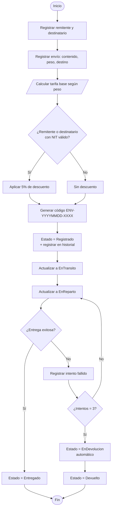
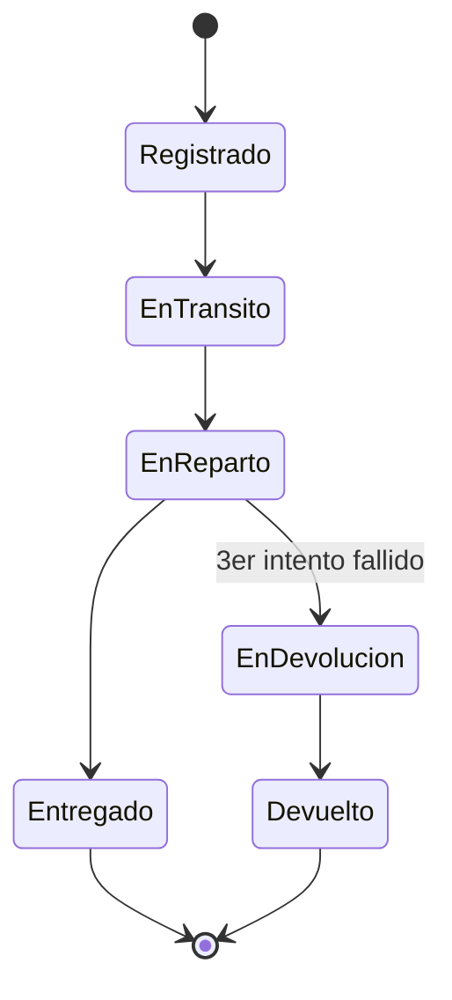
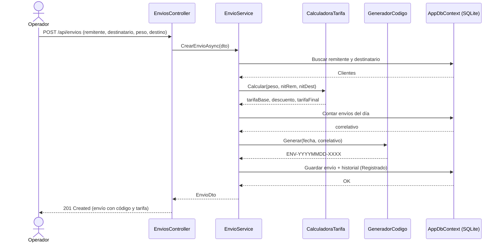
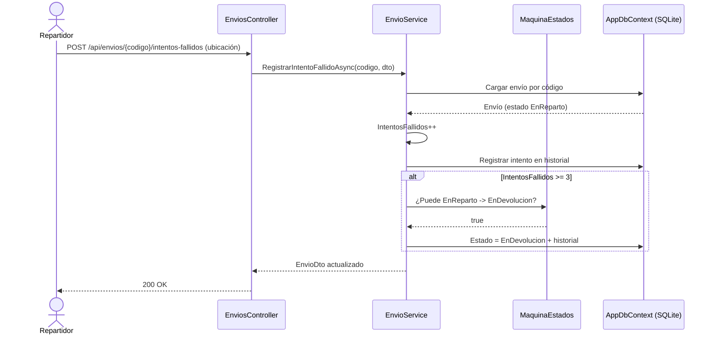
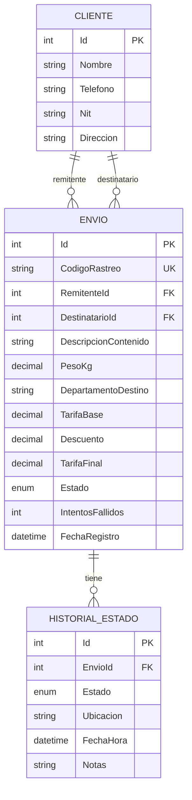

# Diagramas — Envíos Rápidos GT

> Los diagramas están en formato **Mermaid**; GitHub los renderiza automáticamente.

---

## 1. Diagrama de flujo — Proceso de un envío

Flujo completo desde el registro hasta la entrega o devolución.

---

## 2. Diagrama de estados — Ciclo de vida del envío

---

## 3. Diagrama de secuencia — Registrar un envío

---

## 4. Diagrama de secuencia — Intento fallido y devolución automática

---

## 5. Modelo de datos (entidades)

