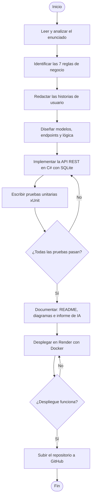

# Diagrama de Flujo — Proceso de Resolución del Examen

**Alumno:** Luis Carlos Lima Pérez · **Carné:** 0907-23-20758

Diagrama del proceso que seguí para resolver la evaluación (no el proceso del sistema).

